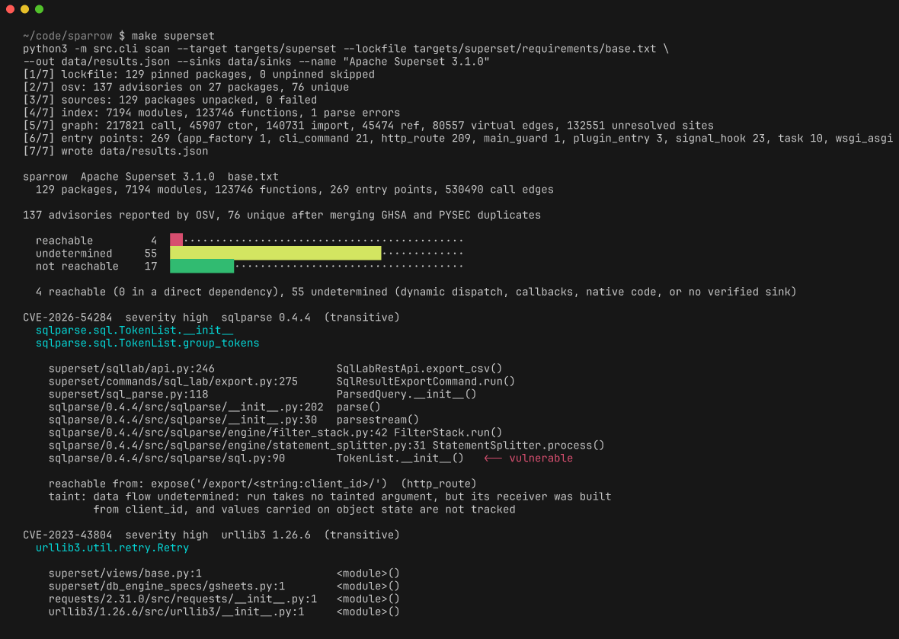

# sparrow



Answers the question a dependency scanner cannot: can your code actually reach the vulnerable function.

**On Apache Superset 3.1.0:** OSV reports 137 advisories across 129 pinned packages. 76 are distinct
vulnerabilities. 4 of those have a concrete call path from an entry point, 17 have no path in the
static graph, and 55 cannot be decided. That third number is printed on purpose.

## Quick start

```bash
git clone https://github.com/Mazen-Alhassan/sparrow && cd sparrow
make run          # sample target, 15 packages, about 5 seconds
make superset     # clones Superset 3.1.0 and runs the real analysis, about 4 minutes cold
make test
```


`pip install -e .` also installs a `sparrow` console script, so `sparrow scan ...` works in place of `python -m src.cli scan ...`.

## What it does

- Reads a pinned lockfile and asks OSV which exact versions are affected
- Downloads every package from PyPI and builds one AST call graph across the application and its dependencies
- Finds entry points: HTTP routes, Celery tasks, click commands, signal hooks, console scripts, app factories
- Extracts the vulnerable function from each advisory with a model, then verifies it against the real patch diff
- Walks from every entry point to every verified sink and sorts the result into three buckets
- Traces each reachable path back to a request parameter, so a finding says whether the input is attacker controlled

## Why this is hard

The advisory says "a flaw in the way the parser handles nested tags". It does not say
`sqlparse.sql.TokenList.__init__`, which is what a call graph needs. Getting from one to the other is
a language problem, and checking the answer is a program analysis problem. Python then makes the
graph itself hard: a route is registered by a decorator, a handler arrives through `getattr`, a
plugin is imported from a string, and a descriptor runs on plain attribute access.

## The three buckets

| Bucket | Meaning | Superset |
|---|---|---|
| reachable | A call path exists. The path is in the output, with file and line for every frame. | 4 |
| undetermined | A path may exist but static analysis cannot decide. | 55 |
| not reachable | No path, and none appears even when every unresolved call site is allowed to dispatch anywhere. | 17 |

A binary reachable or not-reachable output would be a lie by omission. The interesting cases are
exactly the ones a static graph cannot settle, and there are thirteen times more of them than there
are confirmed paths.

## Results

| Metric | Value |
|---|---|
| Advisories reported by OSV | 137 |
| Distinct vulnerabilities after merging GHSA and PYSEC duplicates | 76 |
| Reachable with a call path | 4 |
| Undetermined | 55 |
| Not reachable | 17 |
| Functions indexed across app and dependencies | 123,746 |
| Call graph edges | 533,692 |
| Entry points found | 269 (209 HTTP routes, 23 signal hooks, 21 CLI commands, 10 Celery tasks) |
| Wall clock, warm cache | 23 seconds |
| Call sites that resolve to an edge | 35% (103,322 of 293,962, tests excluded) |
| Sinks that verified against the real patch | 55 of 76 |
| Sink extraction, advisory text only | 12 of 30 exact |
| Sink extraction, advisory plus fix diff | 29 of 30 exact |
| Reachable findings with attacker controlled input | 1 of 4 (`request.json` into `Schema.load`) |

Every extracted sink is checked against the actual package: the named function must exist in the
vulnerable version and be absent or changed in the fixed one. 21 advisories produced no verified
sink and were sent to undetermined rather than being cleared.

Full run in [FINDINGS.md](FINDINGS.md): every call path, why each of the 17 was ruled out, the
ranked list of what defeats the call graph, and what the adversary broke.

## Known limitations

- Python only.
- Reachable doesn't mean exploitable. These 4 findings are leads to investigate, not confirmed exploits. The tracker found 1 tainted result and 3 undetermined.
- Reflection is undetermined. Computed getattr names cause the entire target module to be marked undetermined.
- C extensions are opaque. 129 compiled modules were seen and none were analysed.
- Alembic migrations are skipped. Superset's 293 migration files have invalid module names, so they aren't indexed or treated as entry points.
- unreachable can be wrong in deployment. Plugins, feature flags, and configuration can introduce new entry points.
- Monkeypatching can mislead the graph. Reassigned methods still point to the original function. See case 9 in tests/adversarial/RESULTS.md.
- Sink extraction is imperfect. Advisory text extraction is only ~40% accurate. The verifier catches wrong results and marks them undetermined.
- Two of the four reachable findings have a class attribute as their sink, so "reachable" there means
  the class is constructed, not that a vulnerable function runs. See FINDINGS.md section 1.
